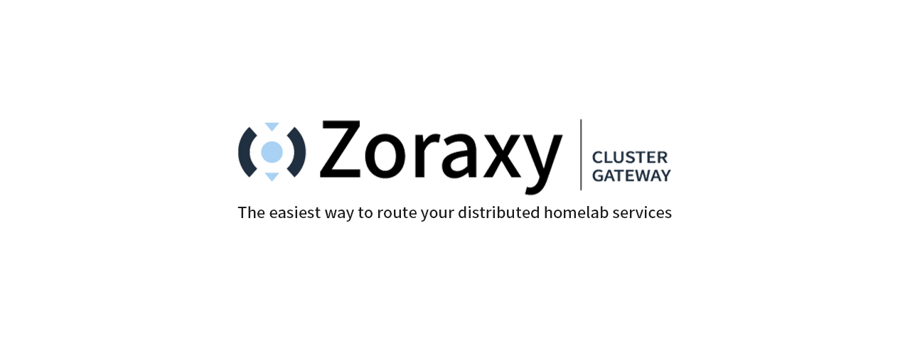
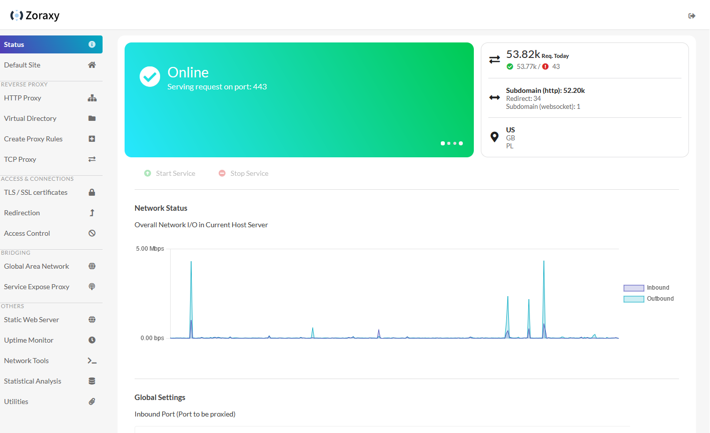
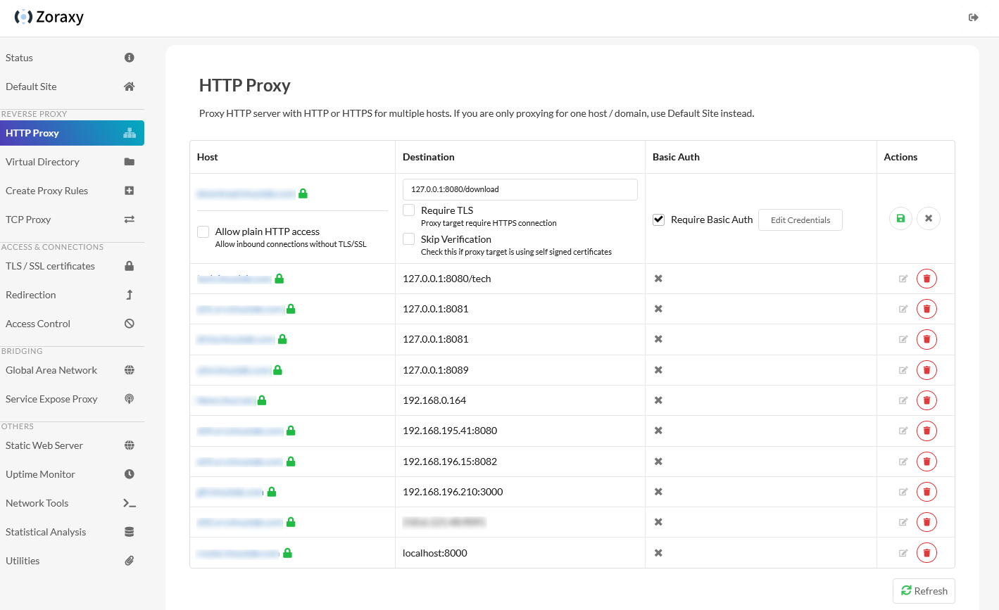

# Zoraxy

A general purpose HTTP reverse proxy and forwarding tool. Now written in Go!


### Features

- Simple to use interface with detail in-system instructions
- Reverse Proxy (HTTP/2)
  - Virtual Directory
  - WebSocket Proxy (automatic, no set-up needed) 
  - Basic Auth
  - Alias Hostnames
  - Custom Headers
- Redirection Rules
- TLS / SSL setup and deploy
  - ACME features like auto-renew to serve your sites in http**s**
  - SNI support (and SAN certs)
  - DNS Challenge for Let's Encrypt and [these DNS providers](https://go-acme.github.io/lego/dns/)
- Blacklist / Whitelist by country or IP address (single IP, CIDR or wildcard for beginners)
- Global Area Network Controller Web UI (ZeroTier not included)
- Stream Proxy (TCP & UDP)
- Integrated Up-time Monitor
- Web-SSH Terminal
- Utilities
  - CIDR IP converters
  - mDNS Scanner
  - Wake-On-Lan
  - Debug Forward Proxy
  - IP Scanner
- Others
  - Basic single-admin management mode
  - External permission management system for easy system integration
  - SMTP config for password reset

## Downloads

[Windows](https://github.com/tobychui/zoraxy/releases/latest/download/zoraxy_windows_amd64.exe)
/[Linux (amd64)](https://github.com/tobychui/zoraxy/releases/latest/download/zoraxy_linux_amd64)
/[Linux (arm64)](https://github.com/tobychui/zoraxy/releases/latest/download/zoraxy_linux_arm64)

For other systems or architectures, please see [Release](https://github.com/tobychui/zoraxy/releases/latest/) 

## Getting Started
[Installing Zoraxy Reverse Proxy: Your Gateway to Efficient Web Routing](https://geekscircuit.com/installing-zoraxy-reverse-proxy-your-gateway-to-efficient-web-routing/)

Thank you for the well written and easy to follow tutorial by Reddit users [itsvmn](https://www.reddit.com/user/itsvmn/)! 
If you have no background in setting up reverse proxy or web routing, you should check this out before you start setting up your Zoraxy. 

## Build from Source

Requires Go 1.22 or higher

```bash
git clone https://github.com/tobychui/zoraxy
cd ./zoraxy/src/
go mod tidy
go build

sudo ./zoraxy -port=:8000
```

## Usage

Zoraxy provides basic authentication system for standalone mode. To use it in standalone mode, follow the instructionss below for your desired deployment platform.

### Standalone Mode

Standalone mode is the default mode for Zoraxy. This allows a single account to manage your reverse proxy server just like a basic home router. This mode is suitable for new owners to homelabs or makers starting growing their web services into multiple servers. A full "Getting Started" guide can be found [here](https://github.com/tobychui/zoraxy/wiki/Getting-Started).

#### Linux

```bash
sudo ./zoraxy -port=:8000
```

#### Windows

Download the binary executable and double click the binary file to start it.

#### Raspberry Pi

The installation method is same as Linux. If you are using a Raspberry Pi 4 or newer models, pick the arm64 release. For older version of Pis, use the arm (armv6) version instead.

#### Other ARM SBCs or Android phone with Termux

The installation method is same as Linux. For other ARM SBCs, please refer to your SBC's CPU architecture and pick the one that is suitable for your device. 

#### Docker

See the [/docker](https://github.com/tobychui/zoraxy/tree/main/docker) folder for more details.

### Start Paramters

```
Usage of zoraxy:
  -autorenew int
        ACME auto TLS/SSL certificate renew check interval (seconds) (default 86400)
  -cfgupgrade
        Enable auto config upgrade if breaking change is detected (default true)
  -docker
        Run Zoraxy in docker compatibility mode
  -fastgeoip
        Enable high speed geoip lookup, require 1GB extra memory (Not recommend for low end devices)
  -mdns
        Enable mDNS scanner and transponder (default true)
  -mdnsname string
        mDNS name, leave empty to use default (zoraxy_{node-uuid}.local)
  -noauth
        Disable authentication for management interface
  -port string
        Management web interface listening port (default ":8000")
  -sshlb
        Allow loopback web ssh connection (DANGER)
  -version
        Show version of this server
  -webfm
        Enable web file manager for static web server root folder (default true)
  -webroot string
        Static web server root folder. Only allow chnage in start paramters (default "./www")
  -ztauth string
        ZeroTier authtoken for the local node
  -ztport int
        ZeroTier controller API port (default 9993)
```

### External Permission Management Mode

If you already have an upstream reverse proxy server in place with permission management, you can use Zoraxy in noauth mode. To enable noauth mode, start Zoraxy with the following flag:

```bash
./zoraxy -noauth=true
```

*Note: For security reaons, you should only enable no-auth if you are running Zoraxy in a trusted environment or with another authentication management proxy in front.*

## Screenshots





More screenshots on the wikipage [Screenshots](https://github.com/tobychui/zoraxy/wiki/Screenshots)!

## FAQ

There is a wikipage with [Frequently-Asked-Questions](https://github.com/tobychui/zoraxy/wiki/FAQ---Frequently-Asked-Questions)!

## Global Area Network Controller

This project also compatible with [ZeroTier](https://www.zerotier.com/). However, due to licensing issues, ZeroTier is not included in the binary. 

To use Zoraxy with ZeroTier, assuming you already have a valid license, install ZeroTier on your host and then run Zoraxy in sudo mode (or Run As Administrator if you are on Windows). The program will automatically grab the authtoken in the correct location on your host.

If you prefer not to run Zoraxy in sudo mode or you have some weird installation profile, you can also pass in the ZeroTier auth token using the following flags::

```bash
./zoraxy -ztauth="your_zerotier_authtoken" -ztport=9993
```

The ZeroTier auth token can usually be found at ```/var/lib/zerotier-one/authtoken.secret``` or ```C:\ProgramData\ZeroTier\One\authtoken.secret```. 

This allows you to have an infinite number of network members in your Global Area Network controller. For more technical details, see [here](https://docs.zerotier.com/self-hosting/network-controllers/).

## Web SSH

Web SSH currently only supports Linux based OSes. The following platforms are supported:

- linux/amd64
- linux/arm64
- linux/armv6 (experimental)
- linux/386 (experimental)

### Loopback Connection

Loopback web SSH connection, by default, is disabled. This means that if you are trying to connect to an address like 127.0.0.1 or localhost, the system will reject your connection for security reasons. To enable loopback for testing or development purpose, use the following flags to override the loopback checking:

```bash
./zoraxy -sshlb=true
```

## Sponsor This Project

If you like the project and want to support us, please consider a donation. You can use the links below

- [tobychui (Primary author)](https://paypal.me/tobychui)
- PassiveLemon (Docker compatibility maintainer)

## License

This project is open-sourced under AGPL. I open-sourced this project so everyone can check for security issues and benefit all users. **This software is intended to be free of charge. If you have acquired this software from a third-party seller, the authors of this repository bears no responsibility for any technical difficulties assistance or support.**

