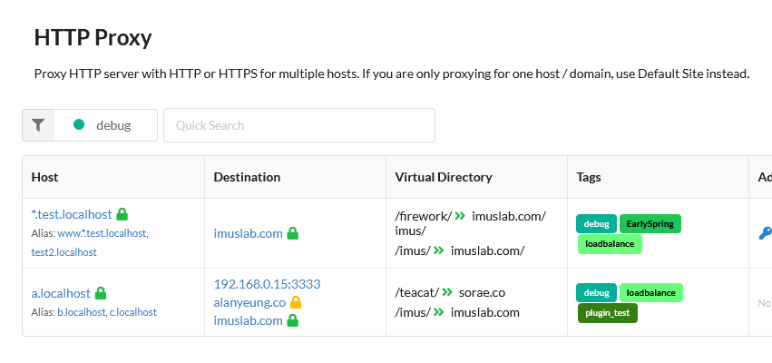

# Enable Plugins

Last Update: 25/05/2025

---

To enable and assign a plugin to a certain HTTP Proxy Rule, you will need to do the following steps

## 1. Create a tag for your HTTP Proxy Rules

Let say you want to enable debugger on some of your HTTP Proxy Rules. You can do that by first creating a tag in the tag editor. In the example below, we will be using the tag "debug". After adding the tag to the HTTP Proxy rule, you will see something like this. 

---

## 2. Enable Plugin

Click on the "Enable" button on the plugin which you want to enable

---

## 3. Assign Plugin to HTTP Proxy Rule

Finally, select the tag that you just created in the dropdown menu

Afterward, you will see the plugin is attached to the target tag

It means the plugin is enabled on the HTTP proxy rule

