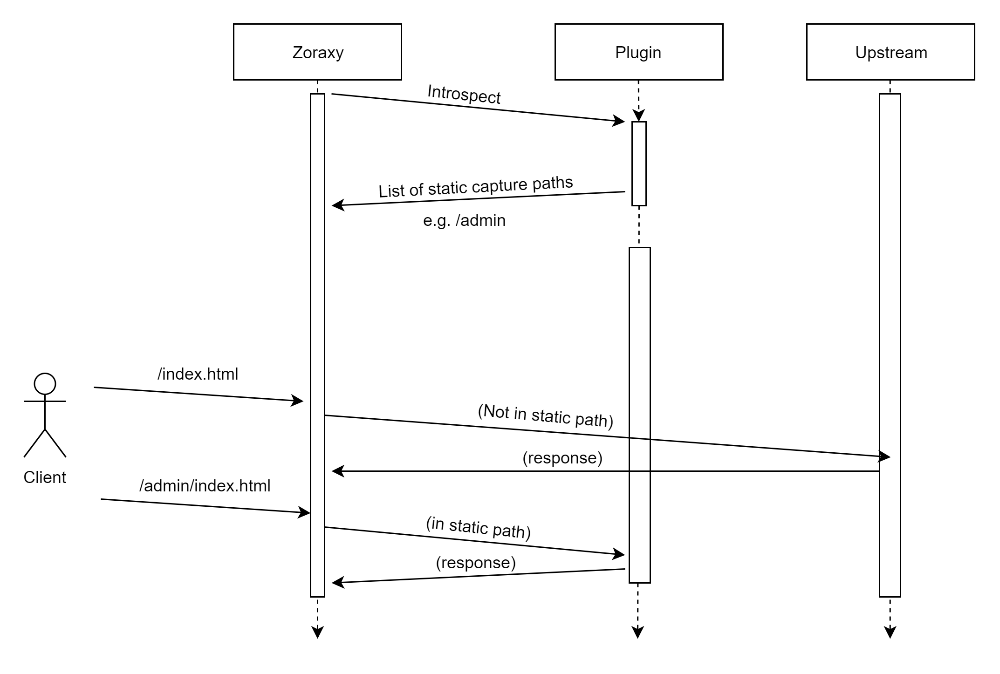

# Capture Modes

As you can see in the Introspect section, there are two types of capture mode in Zoraxy plugin API.

- Static Capture Mode
- Dynamic Capture Mode

**Notes: When this document mention the term "endpoint", it means a particular sub-path on the plugin side. For example `/capture` or `/sniff`. In actual implementation, this can be a `http.HandleFunc` or `http.Handle` depends on the plugin implementation.** 

---

## Static Capture Mode

Static Capture Mode register a static path to Zoraxy, when the plugin is enabled on a certain HTTP proxy rule, all request that matches the static capture registered paths are forwarded to the plugin without asking first. The overall process is shown in the diagram below. 

The main benefit of static capture mode is that the capture paths are stored in radix tree. That means it takes O(logn) time to  resolve the path and forward the request. Hence, **this mode is generally faster** if your plugin always listens to a few certain paths for extended functionalities. 

---

## Dynamic Capture Mode

Dynamic Capture Mode register two endpoints to Zoraxy. 

1. DynamicCaptureSniff - The sniffing endpoint where Zoraxy will first ask if the plugin want to handle this request
2. DynamicCaptureIngress - The handling endpoint, where if the plugin reply the sniffing with "YES", Zoraxy forward the incoming request to this plugin at this defined endpoint.

The whole process will takes a few request exchange between plugin and Zoraxy core. Since both of them are communicating via the loopback interface, speed should not be too big of a concern here. 

The request handling flow is shown in the diagram below.

Once Zoraxy receive a request from a client that matches one of the HTTP Proxy Rule, Zoraxy will forward the request header to all the plugins that matches the following criteria

1. The plugin is assigned to a tag that is currently attached to the given HTTP Proxy that the request is coming through
2. The plugin is enabled and running
3. The plugin has registered its dynamic capture sniffing endpoint in Introspect

Then the plugin `/sniff` endpoint will receive some basic header information about the request, and response with `SniffResultAccpet` or `SniffResultSkip` to accept or reject handling such request. The response are defined in `zoraxy_plugin` as a public type where you can access with `zoraxy_plugin.SniffresultAccept` and  `zoraxy_plugin.SniffResultSkip` respectively. 

Note that this shall only be used if static capture mode cannot satisfy your needs in implementation the feature you want, as **dynamic capture is way slower than static capture mode**. 

---

## Mixing Capture Modes

It is possible for you to mix both Static and Capture modes if that is what you want. A few thing you need to know about mixing both mode in single plugin

1. Static capture mode has higher priority than dynamic capture mode across all plugins. That means if you have a request that matches Plugin A's static capture path and Plugin B's dynamic capture, the request will be first handled by Plugin A
2. The same plugin can register both static and dynamic capture modes. Similar to item (1), if the request has already captured by your static capture path, Zoraxy will not proceed and forward the request header to your dynamic sniffing endpoint.
3. In case there is a collision in static capture paths between two plugins, the longest one will have priority. For example, if Plugin A registered `/foo` and Plugin B registered `/foo/bar`, when a request to `/foo/bar/teacat` enter Zoraxy, Plugin B is used for handling such request.

