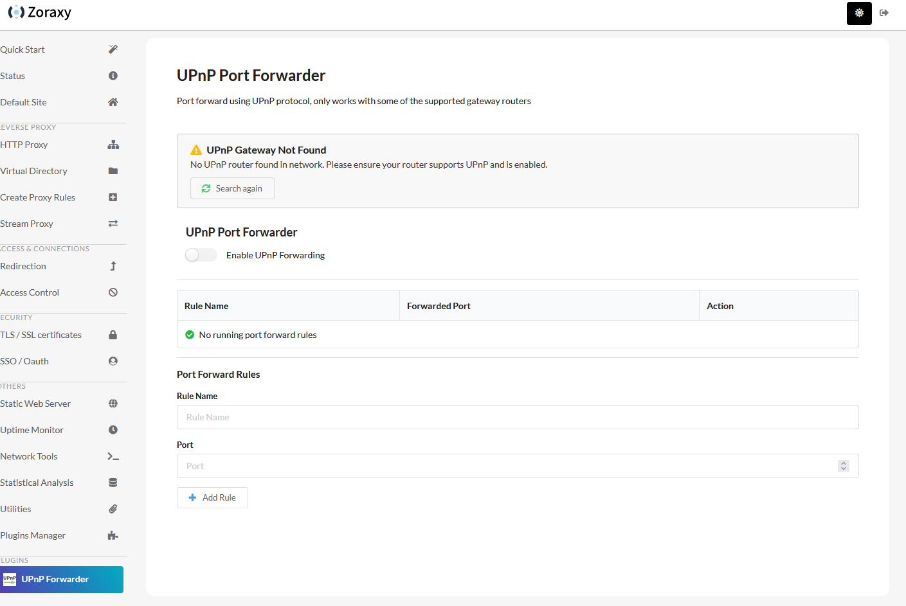

# Plugin UI

Last Update: 25/05/2025

---

A plugin can optionally expose a Web UI interface for user configuration. 

**A plugin must provide a UI, as it is part of the control mechanism of the plugin life cycle. (i.e. Zoraxy use the plugin UI HTTP server to communicate with the plugin for control signals)** As plugin installed via plugin store provides limited ways for a user to configure the plugin, the plugin web UI will be the best way for user to setup your plugin. 

## Plugin Web UI Access

If a plugin provide a Web UI endpoint for Zoraxy during the introspect process, a new item will be shown in the Plugins section on Zoraxy side menu. Below is an example of the Web UI of UPnP Port Forwarder plugin.

## Front-end Developer Notes

The Web UI is implemented as a reverse proxy and embed in an iframe. So you do not need to handle CORS issues with the web UI (as it will be proxy internally by Zoraxy as exposed as something like a virtual directory mounted website). 

However, the plugin web UI is exposed via the path `/plugin.ui/{{plugin_uuid}}/`, for example, `/plugin.ui/org.aroz.zoraxy.plugins.upnp/`. **When developing the plugin web UI, do not use absolute path for any resources used in the HTML file**, unless you are trying to re-use Zoraxy components like css or image elements stored in Zoraxy embedded web file system (e.g. `/img/logo.svg`). 