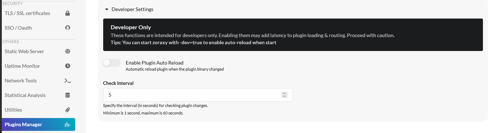

# Hello World!

Last Update: 25/05/2025

---

Let start with a really simple Hello World plugin. This only function of this plugin is to print "Hello World" in the plugin web UI.

---

## 1. Name your plugin

First things first, give your plugin a name. In this example, we are using the name "helloworld". 

**Plugin name cannot contain space or special characters**, so you must use a file name that satisfy the requirement. No worry, the plugin file name is not the same as the plugin display name in the introspect. 

---

## 2. Create the plugin folder

 If your zoraxy root folder do not contains a folder named "plugins", it might implies that your Zoraxy is freshly clone from Github. **You will need to build and run it once to start working on your plugin**, so if you have a newly cloned source code of Zoraxy, do the followings.

```bash
git clone https://github.com/tobychui/zoraxy
cd src
go mod tidy
go build
sudo ./zoraxy
```

Afterward, create a plugin folder under your Zoraxy development environment that is exactly matching your plugin name. In the above example, the folder name should be "helloworld".

```bash
# Assume you are already inside the src/ folder
mkdir helloworld
cd ./helloworld
```

---

## 3. Create a go project

Similar to any Go project, you can start by creating a `main.go` file. Next, you would want to let the go compiler knows your plugin name so when generating a binary file, it knows what to name it. This can be done via using the `go mod init` command.

```bash
touch main.go
go mod init example.com/zoraxy/helloworld
ls
# After you are done, you should see the followings
# go.mod  main.go
```

---

## 4. Copy the Zoraxy plugin lib from Zoraxy source code

 Locate the Zoraxy plugin library from the Zoraxy source code. You can find the `zoraxy_plugin` Go module under                                          `src/mod/plugins/zoraxy_plugin` 

Copy the `zoraxy_plugin` folder from the Zoraxy source code mod folder into the your plugin’s mod folder. Let assume you use the same mod folder name  as Zoraxy as `mod`, then your copied library path should be `plugins/helloword/mod/zoraxy_plugin`                               

```bash
mkdir ./mod
cp -r "mod/plugins/zoraxy_plugin" ./mod/
ls ./mod/zoraxy_plugin/
# You should see something like this (might be different in future versions)
# dev_webserver.go  dynamic_router.go  embed_webserver.go  README.txt  static_router.go  zoraxy_plugin.go
```

---

## 5. Create a web resources folder

Lets create a www folder and put all our web resources, we need to create an `index.html` file as our plugin web ui homepage. This can be done by creating a HTML file in the www folder.

```bash
# Assuming you are currently in the src/plugins/helloworld/ folder
mkdir www
cd www
touch index.html
```


And here is an example `index.html` file that uses the Zoraxy internal resources like css and dark theme toggle mechanism. That csrf token template is not straightly needed in this example as helloworld plugin do not make any POST request to Zoraxy webmin interface, but it might come in handy later.

```html
<!DOCTYPE html>
<html lang="en">
<head>
    <meta charset="UTF-8">
    <!-- CSRF token, if your plugin need to make POST request to backend -->
    <meta name="zoraxy.csrf.Token" content="{{.csrfToken}}">
    <link rel="stylesheet" href="/script/semantic/semantic.min.css">
    <script src="/script/jquery-3.6.0.min.js"></script>
    <script src="/script/semantic/semantic.min.js"></script>
    <script src="/script/utils.js"></script>
    <meta name="viewport" content="width=device-width, initial-scale=1.0">
    <link rel="stylesheet" href="/main.css">
    <title>Hello World</title>
    <style>
        body {
            display: flex;
            justify-content: center;
            align-items: center;
            height: 100vh;
            margin: 0;
            font-family: Arial, sans-serif;
            background:none;
        }
    </style>
</head>
<body>
    <!-- Dark theme script must be included after body tag-->
    <link rel="stylesheet" href="/darktheme.css">
    <script src="/script/darktheme.js"></script>
    <div style="text-align: center;">
        <h1>Hello World</h1>
        <p>Welcome to your first Zoraxy plugin</p>
    </div>
</body>
</html>
```


---

## 6. Creating a handler for Introspect

To create a handler for introspect, you can first start your plugin with a few constants. 

1. Plugin ID, this must be unique.  You can use a domain you own like `com.example.helloworld`
2. UI Path, for now we uses "/" as this plugin do not have any other endpoints, so we can use the whole root just for web UI
3. Web root, for trimming off from the embedded web folder so when user can visit your `index.html` by accessing `/` instead of needing to navigate to `/www` 


After you have defined these constant, we can use `plugin.ServeAndRecvSpec` function to handle the handshake between Zoraxy and your plugin. 

```go
const (
	PLUGIN_ID = "com.example.helloworld"
	UI_PATH   = "/"
	WEB_ROOT  = "/www"
)

func main(){
    runtimeCfg, err := plugin.ServeAndRecvSpec(&plugin.IntroSpect{
		ID:            "com.example.helloworld",
		Name:          "Hello World Plugin",
		Author:        "foobar",
		AuthorContact: "admin@example.com",
		Description:   "A simple hello world plugin",
		URL:           "https://example.com",
		Type:          plugin.PluginType_Utilities,
		VersionMajor:  1,
		VersionMinor:  0,
		VersionPatch:  0,

		// As this is a utility plugin, we don't need to capture any traffic
		// but only serve the UI, so we set the UI (relative to the plugin path) to "/"
		UIPath: UI_PATH,
	})
	if err != nil {
		//Terminate or enter standalone mode here
		panic(err)
	}
}
```


**Notes: If some post processing is needed between Introspect and Configure, you can use two seperate function to handle the first start and the second starting of your plugin. The "seperated version" of `ServeAndRecvSpec` is defined as ` ServeIntroSpect(pluginSpect *IntroSpect) ` and `RecvConfigureSpec() (*ConfigureSpec, error)`. See `zoraxy_plugin.go` for more information.**

---

## 7. Creating a web server from embedded web fs

After that, we need to create a web server to serve our plugin UI to Zoraxy via HTTP. This can be done via the `http.FileServer` but for simplicity and ease of upgrade, the Zoraxy plugin library provided an easy to use embedded web FS server API for plugin developers. 

To use the Zoraxy plugin embedded web server, you first need to embed your web fs into Zoraxy as such.

```go
import (
	_ "embed"
	"fmt"

	plugin "example.com/zoraxy/helloworld/mod/zoraxy_plugin"
)

//go:embed www/*
var content embed.FS
```

Then call to the `NewPluginEmbedUIRouter` to create a new UI router from the embedded Fs. 

```go
// Create a new PluginEmbedUIRouter that will serve the UI from web folder
// The router will also help to handle the termination of the plugin when
// a user wants to stop the plugin via Zoraxy Web UI
embedWebRouter := plugin.NewPluginEmbedUIRouter(PLUGIN_ID, &content, WEB_ROOT, UI_PATH)
```


Here is the tricky part. since not all platform support cross process signaling, Zoraxy plugin uses HTTP request to request a plugin to shutdown. The `embedWebRouter` object has a function named `RegisterTerminateHandler` where you can easily use this function to register actions that needed to be done before shutdown. 

```go
embedWebRouter.RegisterTerminateHandler(func() {
	// Do cleanup here if needed
	fmt.Println("Hello World Plugin Exited")
}, nil)
```

**Notes: This is a blocking function. That is why Zoraxy has a build-in timeout context where if the terminate request takes more than 3 seconds, the plugin process will be treated as "freezed" and forcefully terminated. So please make sure the terminate handler complete its shutdown procedures within 3 seconds.**

---

## 8. Register & Serve the Web UI

After you have created a embedded web router, you can register it to the UI PATH as follows.

```go
// Serve the hello world page in the www folder
http.Handle(UI_PATH, embedWebRouter.Handler())
fmt.Println("Hello World started at http://127.0.0.1:" + strconv.Itoa(runtimeCfg.Port))
err = http.ListenAndServe("127.0.0.1:"+strconv.Itoa(runtimeCfg.Port), nil)
if err != nil {
	panic(err)
}
```


As this is just the standard golang net/http package, you can of course add more Function Handlers to it based on your needs. There are something that you need to know about adding API endpoints, we will discuss this in the later sections.

---

## 9. Build and Test

After saving the `main.go` file, you can now build your plugin with `go build`. It should generate the plugin in your platform architecture and OS. If you are on Linux, it will be `helloworld` and if you are on Windows, it will be `helloworld.exe`. 

After you are done, restart Zoraxy and enable your plugin in the Plugin List. Now you can test and debug  your plugin with your HTTP Proxy Rules. All the STDOUT and STDERR of your plugin will be forwarded to the STDOUT of Zoraxy as well as the log file. 


**Tips**

You can also enable the Developer Option - Plugin Auto Reload function if you are too lazy to restart Zoraxy everytime the plugin binary changed.




---

## 10. Full Code 

This is the full code of the helloworld plugin main.go file.

```go
package main

import (
	"embed"
	_ "embed"
	"fmt"
	"net/http"
	"strconv"

	plugin "example.com/zoraxy/helloworld/mod/zoraxy_plugin"
)

const (
	PLUGIN_ID = "com.example.helloworld"
	UI_PATH   = "/"
	WEB_ROOT  = "/www"
)

//go:embed www/*
var content embed.FS

func main() {
	// Serve the plugin intro spect
	// This will print the plugin intro spect and exit if the -introspect flag is provided
	runtimeCfg, err := plugin.ServeAndRecvSpec(&plugin.IntroSpect{
		ID:            "com.example.helloworld",
		Name:          "Hello World Plugin",
		Author:        "foobar",
		AuthorContact: "admin@example.com",
		Description:   "A simple hello world plugin",
		URL:           "https://example.com",
		Type:          plugin.PluginType_Utilities,
		VersionMajor:  1,
		VersionMinor:  0,
		VersionPatch:  0,

		// As this is a utility plugin, we don't need to capture any traffic
		// but only serve the UI, so we set the UI (relative to the plugin path) to "/"
		UIPath: UI_PATH,
	})
	if err != nil {
		//Terminate or enter standalone mode here
		panic(err)
	}

	// Create a new PluginEmbedUIRouter that will serve the UI from web folder
	// The router will also help to handle the termination of the plugin when
	// a user wants to stop the plugin via Zoraxy Web UI
	embedWebRouter := plugin.NewPluginEmbedUIRouter(PLUGIN_ID, &content, WEB_ROOT, UI_PATH)
	embedWebRouter.RegisterTerminateHandler(func() {
		// Do cleanup here if needed
		fmt.Println("Hello World Plugin Exited")
	}, nil)

	// Serve the hello world page in the www folder
	http.Handle(UI_PATH, embedWebRouter.Handler())
	fmt.Println("Hello World started at http://127.0.0.1:" + strconv.Itoa(runtimeCfg.Port))
	err = http.ListenAndServe("127.0.0.1:"+strconv.Itoa(runtimeCfg.Port), nil)
	if err != nil {
		panic(err)
	}

}

```

