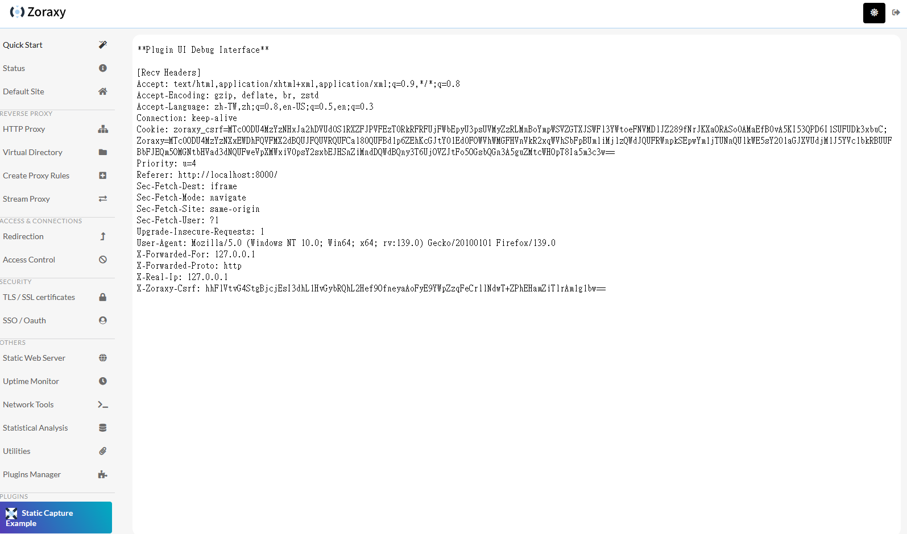
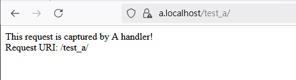

# Static Capture Example  
Last Update: 29/05/2025  

---

This example demonstrates how to use static capture in Zoraxy plugins. Static capture allows you to define specific paths that will be intercepted by your plugin, enabling custom handling of requests to those paths.  

**Notes: This example assumes you have already read Hello World example.**  

---

## 1. Create the plugin folder structure  

Follow the same steps as the Hello World example to set up the plugin folder structure. Refer to the Hello World example sections 1 to 5 for details.  

---

## 2. Define Introspect  

The introspect configuration specifies the static capture paths and ingress for your plugin.  

```go  
runtimeCfg, err := plugin.ServeAndRecvSpec(&plugin.IntroSpect{  
    ID:            "org.aroz.zoraxy.static-capture-example",  
    Name:          "Static Capture Example",  
    Author:        "aroz.org",  
    AuthorContact: "https://aroz.org",  
    Description:   "An example for showing how static capture works in Zoraxy.",  
    URL:           "https://zoraxy.aroz.org",  
    Type:          plugin.PluginType_Router,  
    VersionMajor:  1,  
    VersionMinor:  0,  
    VersionPatch:  0,  

    StaticCapturePaths: []plugin.StaticCaptureRule{  
        { CapturePath: "/test_a" },  
        { CapturePath: "/test_b" },  
    },  
    StaticCaptureIngress: "/s_capture",  
    UIPath: UI_PATH,  
})  
if err != nil {  
    panic(err)  
}  
```

Note the `StaticCapturePaths`. These are the paths that you want to capture in your plugin. These paths will be registered to Zoraxy and when a user have request that matches these paths (including subpaths), the request will get forwarded to your plugin. In this example, we are intercepting the `/test_a` and `test_b` sub-path.

We also defined a new value named `StaticCaptureIngress`. This is to tell Zoraxy that "if you receive requests that matches the above Static capture paths, please forward the request to this endpoint". In this example, this plugin asked Zoraxy to forward th HTTP traffic to `/s_capture` if anything is matched.


---

## 3. Register Static Capture Handlers  

Static capture handlers are used to process requests to the defined paths.  Similar to ordinary http.HandleFunc, you can register `http.HandleFunc` as follows.

```go  
pathRouter := plugin.NewPathRouter()  

pathRouter.RegisterPathHandler("/test_a", http.HandlerFunc(HandleCaptureA))  
pathRouter.RegisterPathHandler("/test_b", http.HandlerFunc(HandleCaptureB))  

pathRouter.SetDefaultHandler(http.HandlerFunc(func(w http.ResponseWriter, r *http.Request) {  
    w.Header().Set("Content-Type", "text/html")  
    w.Write([]byte("This request is captured by the default handler!<br>Request URI: " + r.URL.String()))  
}))  

pathRouter.RegisterStaticCaptureHandle(STATIC_CAPTURE_INGRESS, http.DefaultServeMux)  
```


The `SetDefaultHandler` is used to handle exceptions where a request is forwarded to your plugin but it cannot be handled by any of your registered path handlers. This is usually an implementation bug on the plugin side and you can add some help message or debug log to this function if needed.

The `RegisterStaticCaptureHandle` is used to register the static capture ingress endpoint, so Zoraxy knows where to forward the HTTP request when it thinks your plugin shall be the one handling the request. In this example, `/s_capture` is used for static capture endpoint.

---

## 4. Implement Handlers  

Here are examples of handlers for the captured paths:  

### Handler for `/test_a`  

```go  
func HandleCaptureA(w http.ResponseWriter, r *http.Request) {  
    w.Header().Set("Content-Type", "text/html")  
    w.Write([]byte("This request is captured by A handler!<br>Request URI: " + r.URL.String()))  
}  
```

### Handler for `/test_b`  

```go  
func HandleCaptureB(w http.ResponseWriter, r *http.Request) {  
    w.Header().Set("Content-Type", "text/html")  
    w.Write([]byte("This request is captured by the B handler!<br>Request URI: " + r.URL.String()))  
}  
```


When the user request any HTTP Proxy Rule with the matching path, these two handlers will response to the request and return the hardcoded string above. Again, this is just for demonstration purpose and you should implement your functions here.


---

## 5. Render Debug UI  

The debug UI provides a simple interface for testing and inspecting requests.  

```go  
func RenderDebugUI(w http.ResponseWriter, r *http.Request) {  
    fmt.Fprint(w, "**Plugin UI Debug Interface**\n\n[Recv Headers] \n")  

    headerKeys := make([]string, 0, len(r.Header))  
    for name := range r.Header {  
        headerKeys = append(headerKeys, name)  
    }  
    sort.Strings(headerKeys)  
    for _, name := range headerKeys {  
        values := r.Header[name]  
        for _, value := range values {  
            fmt.Fprintf(w, "%s: %s\n", name, value)  
        }  
    }  
    w.Header().Set("Content-Type", "text/html")  
}  
```

This is technically not related to static capturing, but it is really helpful to have a UI to help with printing debug information. You can access the page rendered by this function in the Zoraxy plugin menu.  This should be replaced with the embedded web fs used in the Hello world example after the development is completed.




## 6. Full Code  

Here is the complete code for the static capture example: 

```go  
package main  

import (  
    "fmt"  
    "net/http"  
    "sort"  
    "strconv"  

    plugin "example.com/zoraxy/static-capture-example/mod/zoraxy_plugin"  
)  

const (  
    PLUGIN_ID              = "org.aroz.zoraxy.static-capture-example"  
    UI_PATH                = "/ui"  
    STATIC_CAPTURE_INGRESS = "/s_capture"  
)  

func main() {  
    runtimeCfg, err := plugin.ServeAndRecvSpec(&plugin.IntroSpect{  
        ID:            PLUGIN_ID,  
        Name:          "Static Capture Example",  
        Author:        "aroz.org",  
        AuthorContact: "https://aroz.org",  
        Description:   "An example for showing how static capture works in Zoraxy.",  
        URL:           "https://zoraxy.aroz.org",  
        Type:          plugin.PluginType_Router,  
        VersionMajor:  1,  
        VersionMinor:  0,  
        VersionPatch:  0,  
        StaticCapturePaths: []plugin.StaticCaptureRule{  
            { CapturePath: "/test_a" },  
            { CapturePath: "/test_b" },  
        },  
        StaticCaptureIngress: STATIC_CAPTURE_INGRESS,  
        UIPath: UI_PATH,  
    })  
    if err != nil {  
        panic(err)  
    }  

    pathRouter := plugin.NewPathRouter()  
    pathRouter.RegisterPathHandler("/test_a", http.HandlerFunc(HandleCaptureA))  
    pathRouter.RegisterPathHandler("/test_b", http.HandlerFunc(HandleCaptureB))  
    pathRouter.SetDefaultHandler(http.HandlerFunc(func(w http.ResponseWriter, r *http.Request) {  
        w.Header().Set("Content-Type", "text/html")  
        w.Write([]byte("This request is captured by the default handler!<br>Request URI: " + r.URL.String()))  
    }))  
    pathRouter.RegisterStaticCaptureHandle(STATIC_CAPTURE_INGRESS, http.DefaultServeMux)  

    http.HandleFunc(UI_PATH+"/", RenderDebugUI)  
    fmt.Println("Static path capture example started at http://127.0.0.1:" + strconv.Itoa(runtimeCfg.Port))  
    http.ListenAndServe("127.0.0.1:"+strconv.Itoa(runtimeCfg.Port), nil)  
}  

func HandleCaptureA(w http.ResponseWriter, r *http.Request) {  
    w.Header().Set("Content-Type", "text/html")  
    w.Write([]byte("This request is captured by A handler!<br>Request URI: " + r.URL.String()))  
}  

func HandleCaptureB(w http.ResponseWriter, r *http.Request) {  
    w.Header().Set("Content-Type", "text/html")  
    w.Write([]byte("This request is captured by the B handler!<br>Request URI: " + r.URL.String()))  
}  

func RenderDebugUI(w http.ResponseWriter, r *http.Request) {  
    fmt.Fprint(w, "**Plugin UI Debug Interface**\n\n[Recv Headers] \n")  

    headerKeys := make([]string, 0, len(r.Header))  
    for name := range r.Header {  
        headerKeys = append(headerKeys, name)  
    }  
    sort.Strings(headerKeys)  
    for _, name := range headerKeys {  
        values := r.Header[name]  
        for _, value := range values {  
            fmt.Fprintf(w, "%s: %s\n", name, value)  
        }  
    }  
    w.Header().Set("Content-Type", "text/html")  
}  
```

---

## 7. Expected Output  

To enable the plugin, add the plugin to one of the tags and assign the tag to your HTTP Proxy Rule. Here is an example of assigning the plugin to the "debug" tag and assign it to a localhost loopback HTTP proxy rule.


When the plugin is running, requests to `/test_a` and `/test_b` will be intercepted by their respective handlers. **Requests to other paths will not pass through your plugin and will be handled by the default upstream server set by the HTTP proxy Rule.**




Example terminal output for requesting `/test_a`:  

```
This request is captured by A handler!  
Request URI: /test_a  
```

Example output for requesting  `/test_b`:  
```
This request is captured by the B handler!  
Request URI: /test_b  
```

---

Enjoy exploring static capture in Zoraxy!  

