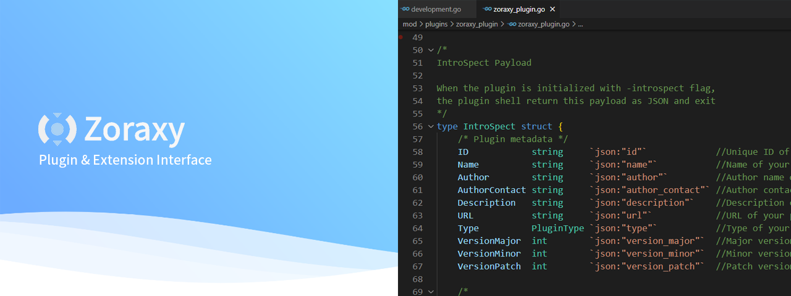

    

# Index  

Welcome to the Zoraxy Plugin Documentation!  
Click on a topic in the side menu to begin navigating through the available resources and guides for developing and managing plugins.

## FAQ
### What skills do I need for developing a plugin?  
Basic HTML, JavaScript, and CSS skills are required, with Go (Golang) being the preferred backend language. However, any programming language that can be compiled into a binary and provide a web server interface will work.  

### Will a plugin crash the whole Zoraxy?  
No. Plugins operate in a separate process from Zoraxy. If a plugin crashes, Zoraxy will terminate and disable that plugin without affecting the core operations. This is by design to ensure stability.  

### Can I sell my plugin?  
Yes, the plugin library and interface design are open source under the LGPL license. You are not required to disclose the source code of your plugin as long as you do not modify the plugin library and use it as-is. For more details on how to comply with the license, refer to the licensing documentation.  

### How can I add my plugin to the official plugin store?  
To add your plugin to the official plugin store, open a pull request (PR) in the plugin repository.  

## GNU Free Documentation License

This documentation is licensed under the GNU Free Documentation License, Version 1.3 or any later version published by the Free Software Foundation; with no Invariant Sections, no Front-Cover Texts, and no Back-Cover Texts. You may copy, distribute, and modify this document under the terms of the license.

A copy of the license is available at [https://www.gnu.org/licenses/fdl-1.3.html](https://www.gnu.org/licenses/fdl-1.3.html).